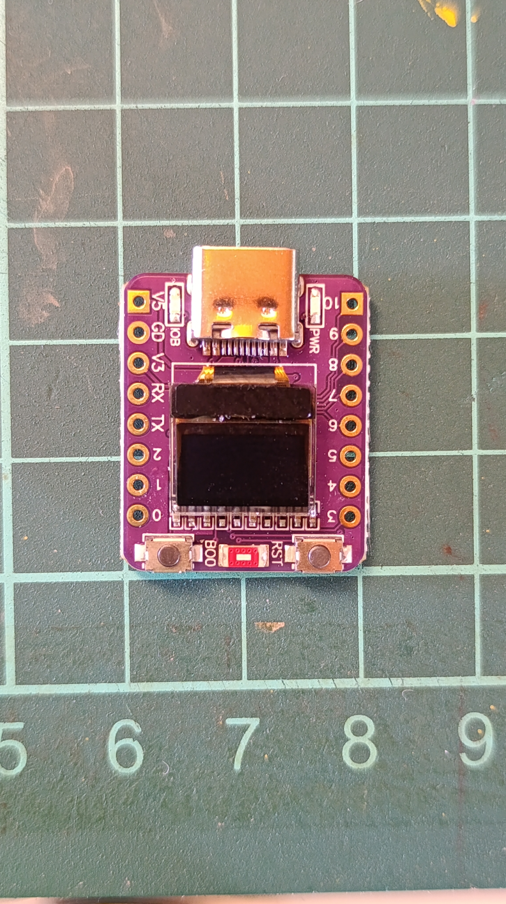
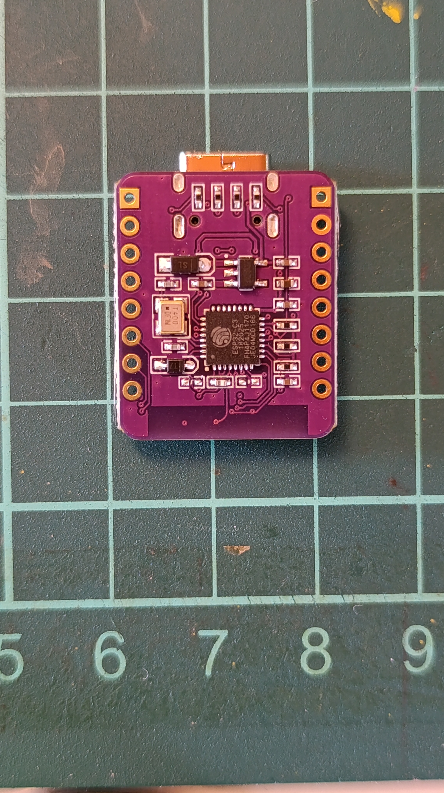

# ESP32-C3-72x40-OLED
This is a very cheap esp32-c3 based dev board and has a little 0.42" 72x40 oled display.  
ESP32C3FH4 = Ultra-Low-Power SoC with RISC-V Single-Core CPU 2.4 GHz Wi-Fi (802.11b/g/n) and Bluetooth® 5 (LE)  
More =  https://www.mouser.com.tr/datasheet/2/891/esp32_c3_datasheet_en-1989865.pdf
# DISPLAY
Display is monochrome 72x40 oled.  

| Display  | ESP32    |
|----------|----------|
| SCL      | GPIO6    |
| SDA      | GPIO5    |

Use foam tape to tape the screen  to the board.

# UPLOADING
You can upload codes using Arduino ide.  
-Install esp32 drivers from board manager (https://github.com/espressif/arduino-esp32)  
-Install U8G2 library for oled. You can use different libraries (https://github.com/olikraus/u8g2)  
-Select "ESP32C3 DEV MODULE" when uploading

# BUY (AFFILIATE)

# IMAGES
   
